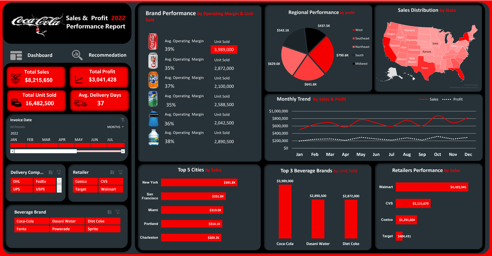

# Coca- Cola-Dashboard---Excel-Challenge

This project showcases the process followed to build a professional Excel dashboard as part of a dashboard design challenge from X(Twitter). 
For me challenges are opportunity to learn, develop and grow.Hence,
the focus was on process execution, not on deriving business insights.

## Project Workflow Summary

| Step | Task                        | Description                                                |
|------|-----------------------------|------------------------------------------------------------|
| 1    | Data Verification           | Checked for blanks and duplicates                          |
| 2    | Data Backup                 | Copied raw data to a separate worksheet                    |
| 3    | Date Formatting             | Used `TEXT()` and Text to Columns for proper alignment     |
| 4    | Table Conversion            | Converted to Excel Table (`Ctrl + T`)                      |
| 5    | Pivot Table Creation        | Built Pivot Tables for analysis                            |
| 6    | KPI Calculation             | Calculated sales, profit, units sold, and avg. delivery    |
| 7    | Additional Analysis         | Created supporting calculations for the report             |
| 8    | Chart Visualization         | Used pie, bar, line, and map charts                        |
| 9    | Branding                    | Applied Coca-Cola colors via HEX codes                     |
| 10   | Interactivity               | Added slicers, timeline, and icons                         |
| 11   | Dashboard Assembly          | Final layout and design setup                              |

---

### Dashboard Preview
- 

---

## Detailed Process

### 1. Data Preparation  
- Verified dataset integrity (no duplicates or blanks)  
- Copied raw data to a new worksheet to preserve the original  
- Reformatted date values using `TEXT()` and aligned them via *Text to Columns*

### 2. Data Structuring  
- Converted dataset to an Excel Table (`Ctrl + T`)  
- Created Pivot Tables for dynamic analysis of KPIs and breakdowns

### 3. KPI Calculation  
- Total Sales  
- Total Profit  
- Total Units Sold  
- Average Delivery Days

### 4. Visualization  
- Selected and customized pie, bar, line, and map charts  
- Applied Coca-Cola branding colors:
  - Red: `#f40000`  
  - Black: `#000000`  
  - White: `#ffffff`  
  - Midnight Gray: `#263238`

### 5. Interactivity & Final Layout  
- Enhanced user experience using slicers, timeline filters, and icons  
- Designed a clean, visually engaging dashboard layout

---

## About Me
I'm an aspiring data analyst passionate about uncovering business insight through storytelling and dashboard design.
currently developing my skills with other advance analytics tools  in view.
